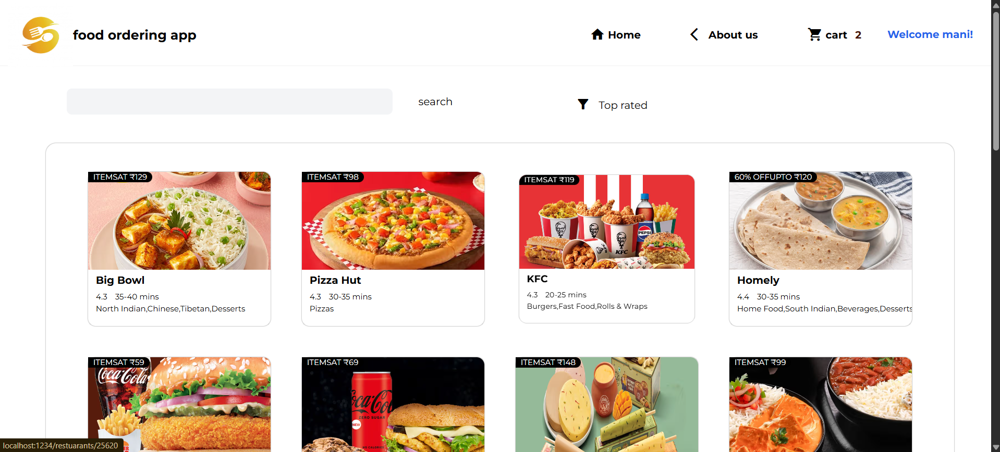
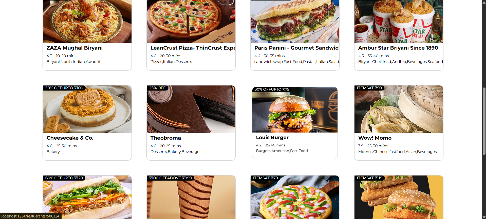
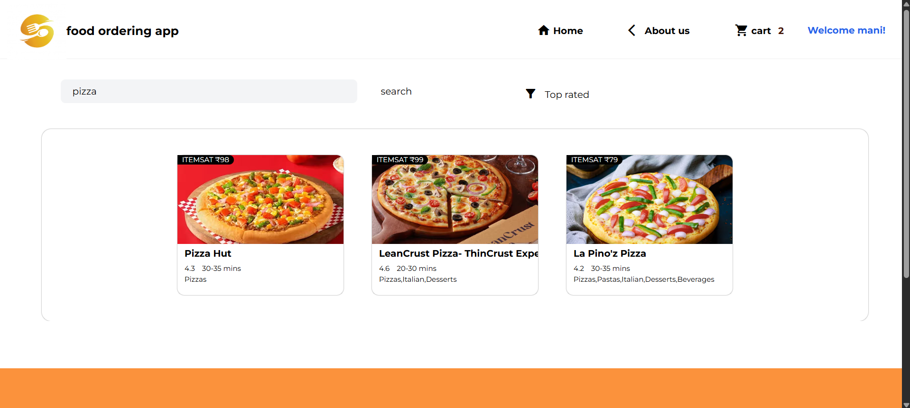
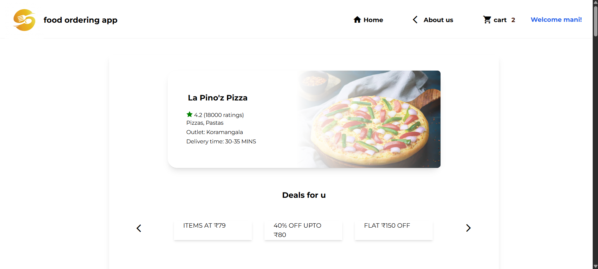
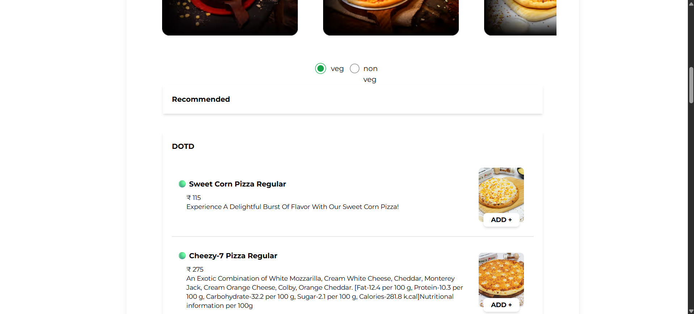
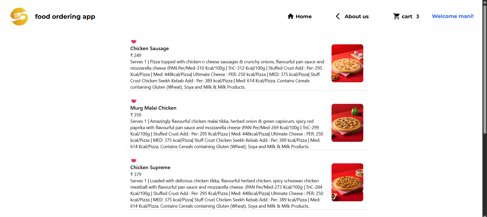

# 🍔 Online Food Ordering Website

**Online Food Ordering Website** is a React-based web app designed to simulate a food delivery experience. By fetching data from **Swiggy’s API** (for educational purposes only), users can browse restaurants, view menus, and add items to a cart.

---

## 🚀 Project Overview

Users often want to explore restaurants and order food online, but building an interactive front-end that displays live menu data helps in learning modern web development techniques. **Online Food Ordering Website** provides this experience:

- Browse restaurants and their menus.
- Filter menu items by **Veg/Non-Veg**.
- Add items to a cart with dynamic item count.
- Explore menu descriptions and prices.

---

## 🧠 Features

- 🥗 **Veg / Non-Veg Filtering** for menu items.
- 🛒 **Add-to-Cart Functionality** with dynamic item count.
- 📄 **Menu Details** including description and price.
- 🔍 **Search Functionality** to find restaurants or menu items quickly.
- ⭐ **Filter Based on Rating** to show top-rated restaurants or dishes.
- ⚡ **React + Redux Store** for smooth state management.
- ☁️ **Firebase Hosting** for deployment.

---

## 🧰 Tech Stack

| Category | Technology                 |
| -------- | -------------------------- |
| Frontend | React, Redux, Tailwind CSS |
| API      | Swiggy API (educational)   |
| Hosting  | Firebase Hosting           |
| State    | React Hooks + Redux        |

---

## 🌐 Hosting Details

This project is hosted using **Firebase Hosting**.

> ⚠️ **Important:** Swiggy API will block requests from some origins. Use a **CORS policy extension** in your browser for local testing.

🔗 **Live URL:** [https://your-firebase-hosting-url](https://fooddelivaryapp-43595.web.app/)

🖼️ **Screenshots:**

**home page**

**Restaurant page**

**Cart / Order Page**

